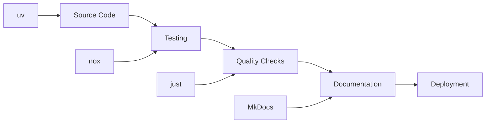

# Algorithm Kit

**Algorithm Kit** is a modern Python project built with best practices and comprehensive tooling for implementing control and learning algorithms.

[:material-arrow-right: Get Started](api.md){ .md-button .md-button--primary }
[:material-play: Run Tests](https://github.com/jeffrichley/algokit#development){ .md-button }

[:material-book-open: Documentation](api.md) · [:material-code-braces: Source Code](https://github.com/jeffrichley/algokit) · [:material-github: GitHub](https://github.com/jeffrichley/algokit)

## Algorithm Families

- [Classic Dynamic Programming](classic-dp.md)
  - Linear DP
    - [Fibonacci](classic-dp.md#fibonacci)
    - [Longest Increasing Subsequence (LIS)](classic-dp.md#longest-increasing-subsequence-lis)
    - [Maximum Subarray (Kadane's Algorithm)](classic-dp.md#maximum-subarray-kadane-s-algorithm)
    - [House Robber](classic-dp.md#house-robber)
    - [Climbing Stairs](classic-dp.md#climbing-stairs)
    - [Jump Game I & II](classic-dp.md#jump-game-i-ii)
  - 2D / Grid-Based DP
    - [Unique Paths](classic-dp.md#unique-paths)
    - [Minimum Path Sum](classic-dp.md#minimum-path-sum)
    - [Longest Common Subsequence (LCS)](classic-dp.md#longest-common-subsequence-lcs)
    - [Edit Distance](classic-dp.md#edit-distance)
    - [Maximum Square Submatrix](classic-dp.md#maximum-square-submatrix)
  - Knapsack Variants
    - [0/1 Knapsack](classic-dp.md#0-1-knapsack)
    - [Unbounded Knapsack](classic-dp.md#unbounded-knapsack)
    - [Partition Equal Subset Sum](classic-dp.md#partition-equal-subset-sum)
    - [Target Sum](classic-dp.md#target-sum)
  - String DP
    - [Longest Common Subsequence (LCS)](classic-dp.md#longest-common-subsequence-lcs-1)
    - [Edit Distance](classic-dp.md#edit-distance-1)
    - [Regular Expression Matching](classic-dp.md#regular-expression-matching)
    - [Wildcard Matching](classic-dp.md#wildcard-matching)
    - [Palindromic Substrings](classic-dp.md#palindromic-substrings)
  - Interval DP
    - [Matrix Chain Multiplication](classic-dp.md#matrix-chain-multiplication)
    - [Burst Balloons](classic-dp.md#burst-balloons)
    - [Palindrome Partitioning](classic-dp.md#palindrome-partitioning)
  - Bitmask / Digit DP
    - [Traveling Salesman Problem (TSP)](classic-dp.md#traveling-salesman-problem-tsp)
    - [Assignment Problem](classic-dp.md#assignment-problem)
    - [Digit Sum Count](classic-dp.md#digit-sum-count)
  - Tree/DAG DP
    - [Diameter of Tree](classic-dp.md#diameter-of-tree)
    - [House Robber III](classic-dp.md#house-robber-iii)
    - [Longest Path in DAG](classic-dp.md#longest-path-in-dag)
- [Reinforcement Learning (Model-Free)](reinforcement-learning.md)
  - [Q-Learning](reinforcement-learning.md#q-learning)
  - [SARSA](reinforcement-learning.md#sarsa)
  - [Deep Q-Network (DQN)](reinforcement-learning.md#deep-q-network-dqn)
  - [Proximal Policy Optimization (PPO)](reinforcement-learning.md#proximal-policy-optimization-ppo)
  - [A2C / A3C](reinforcement-learning.md#a2c-a3c)
- [Hierarchical Reinforcement Learning](hrl.md)
  - [Options Framework](hrl.md#options-framework)
  - [Feudal Reinforcement Learning](hrl.md#feudal-reinforcement-learning)
  - [MAXQ Decomposition](hrl.md#maxq-decomposition)
  - [HIRO](hrl.md#hiro)
- [Dynamic Movement Primitives](dmps.md)
  - [DMP Encoding/Decoding](dmps.md#dmp-encoding-decoding)
  - [Imitation Learning Using DMPs](dmps.md#imitation-learning-using-dmps)
- [Gaussian Process Modeling](gaussian-process.md)
  - [Gaussian Process Regression](gaussian-process.md#gaussian-process-regression)
  - [Sparse Gaussian Processes](gaussian-process.md#sparse-gaussian-processes)
  - [Bayesian Optimization](gaussian-process.md#bayesian-optimization)
  - [PILCO](gaussian-process.md#pilco)
- [Real-Time Control](real-time-control.md)
  - [PID Controller (P/PI/PD/PID)](real-time-control.md#pid-controller-p-pi-pd-pid)
  - [Bang-bang Control](real-time-control.md#bang-bang-control)
  - [Kalman Filter](real-time-control.md#kalman-filter)
- [Model Predictive Control](mpc.md)
  - [Finite Horizon MPC](mpc.md#finite-horizon-mpc)
  - [Nonlinear MPC](mpc.md#nonlinear-mpc)
  - [Learning-based MPC](mpc.md#learning-based-mpc)
- [Classical Planning Algorithms](classical-planning.md)
  - [A*](classical-planning.md#a)
  - [Dijkstra's](classical-planning.md#dijkstra-s)
  - [RRT / PRM](classical-planning.md#rrt-prm)
  - [STRIPS / PDDL](classical-planning.md#strips-pddl)


## Quick Start

Get up and running with Algorithm Kit in minutes:

- **Install**: `uv pip install -e .` (editable development install)
- **Test**: `just test` (run the test suite)
- **Lint**: `just lint` (check code quality)

=== "CLI"

    ```bash
    # Install in editable mode
    uv pip install -e .

    # Run tests
    just test

    # Check code quality
    just lint
    ```

=== "Python"

    ```python
    # Import the package
    import algokit

    # Your algorithm implementations here
    print("Algorithm Kit is ready!")
    ```

!!! tip "Need help setting up?"
    See our [Development Guide](https://github.com/jeffrichley/algokit#development) for environment setup and dependencies.

## Feature Highlights

- **Modern Python Tooling**: Built with uv, nox, and just for optimal development experience
- **Quality Assurance**: Comprehensive testing, linting, and type checking
- **Documentation**: Automated documentation generation with MkDocs
- **CI/CD Ready**: Pre-configured GitHub Actions workflows
- **Type Safety**: Full type hints and mypy integration
- **Extensible Architecture**: Modular design with plugin support

## Technology Stack

- **Package Manager**: uv for fast dependency management
- **Testing**: pytest with comprehensive coverage reporting
- **Linting**: ruff for fast Python linting
- **Formatting**: black for consistent code formatting
- **Type Checking**: mypy for static type analysis
- **Documentation**: MkDocs with Material theme
- **CI/CD**: GitHub Actions with quality gates

## Architecture at a Glance



## Why Algorithm Kit?

- **Faster development**: Modern tooling stack reduces setup time
- **Quality by design**: Comprehensive testing and linting from day one
- **Professional standards**: Production-ready CI/CD and documentation
- **Extensible**: Plugin architecture for custom algorithms

## Get Started

<div class="grid cards" markdown>

-   :material-rocket-launch: **[Quickstart](api.md)**

    Get up and running in 10 minutes

-   :material-cog: **[Installation](https://github.com/jeffrichley/algokit#development)**

    Set up your development environment

-   :material-play: **[Testing](https://github.com/jeffrichley/algokit#development)**

    Run the test suite and quality checks

-   :material-cog-outline: **[Configuration](https://github.com/jeffrichley/algokit#development)**

    Configure your development workflow

-   :material-puzzle: **[Contributing](contributing.md)**

    Contribute to the project

-   :material-shield-check: **[Quality](https://github.com/jeffrichley/algokit#development)**

    Maintain high code quality standards

</div>

## Development

For more detailed information about the project architecture, development guidelines, and quality standards, please refer to the project documentation in the main repository.

[:material-code-braces: API Reference](api.md)

Spotted an issue? Edit this page.
