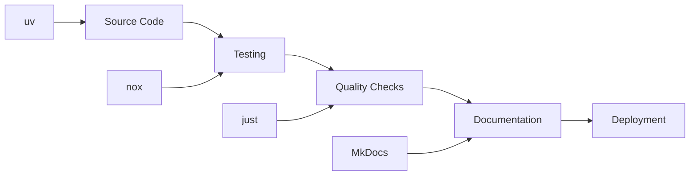

# Algorithm Kit

**Algorithm Kit** is a modern Python project built with best practices and comprehensive tooling for implementing control and learning algorithms.

[:material-arrow-right: Get Started](api.md){ .md-button .md-button--primary }
[:material-play: Run Tests](https://github.com/jeffrichley/algokit#development){ .md-button }

[:material-book-open: Documentation](api.md) · [:material-code-braces: Source Code](https://github.com/jeffrichley/algokit) · [:material-github: GitHub](https://github.com/jeffrichley/algokit)

## Algorithm Families

Explore the algorithm landscapes covered by Algorithm Kit.

| Family | Highlighted Algorithms | Status |
| --- | --- | --- |
| [Classic Dynamic Programming](classic-dp.md) | Fibonacci, LIS, Knapsack | :material-progress-clock: Coming Soon |
| [Reinforcement Learning (Model-Free)](reinforcement-learning.md) | Q-Learning, SARSA, DQN | :material-progress-clock: Coming Soon |
| [Hierarchical Reinforcement Learning](hrl.md) | Options, Feudal RL, MAXQ, HIRO | :material-progress-clock: Coming Soon |
| [Dynamic Movement Primitives](dmps.md) | DMP Encoding, Imitation Learning | :material-progress-clock: Coming Soon |
| [Gaussian Process Modeling](gaussian-process.md) | Regression, Bayesian Optimization | :material-progress-clock: Coming Soon |
| [Real-Time Control](real-time-control.md) | PID, Bang-bang, Kalman Filter | :material-progress-clock: Coming Soon |
| [Model Predictive Control](mpc.md) | Finite Horizon, Nonlinear, Learning-based | :material-progress-clock: Coming Soon |
| [Classical Planning Algorithms](classical-planning.md) | A*, Dijkstra, RRT, STRIPS | :material-progress-clock: Coming Soon |

**Status legend**: :material-code-tags: Code available · :material-progress-clock: Coming Soon

## Quick Start

Get up and running with Algorithm Kit in minutes:

- **Install**: `uv pip install -e .` (editable development install)
- **Test**: `just test` (run the test suite)
- **Lint**: `just lint` (check code quality)

=== "CLI"

    ```bash
    # Install in editable mode
    uv pip install -e .

    # Run tests
    just test

    # Check code quality
    just lint
    ```

=== "Python"

    ```python
    # Import the package
    import algokit

    # Your algorithm implementations here
    print("Algorithm Kit is ready!")
    ```

!!! tip "Need help setting up?"
    See our [Development Guide](https://github.com/jeffrichley/algokit#development) for environment setup and dependencies.

## Feature Highlights

- **Modern Python Tooling**: Built with uv, nox, and just for optimal development experience
- **Quality Assurance**: Comprehensive testing, linting, and type checking
- **Documentation**: Automated documentation generation with MkDocs
- **CI/CD Ready**: Pre-configured GitHub Actions workflows
- **Type Safety**: Full type hints and mypy integration
- **Extensible Architecture**: Modular design with plugin support

## Technology Stack

- **Package Manager**: uv for fast dependency management
- **Testing**: pytest with comprehensive coverage reporting
- **Linting**: ruff for fast Python linting
- **Formatting**: black for consistent code formatting
- **Type Checking**: mypy for static type analysis
- **Documentation**: MkDocs with Material theme
- **CI/CD**: GitHub Actions with quality gates

## Architecture at a Glance



## Why Algorithm Kit?

- **Faster development**: Modern tooling stack reduces setup time
- **Quality by design**: Comprehensive testing and linting from day one
- **Professional standards**: Production-ready CI/CD and documentation
- **Extensible**: Plugin architecture for custom algorithms

## Get Started

<div class="grid cards" markdown>

-   :material-rocket-launch: **[Quickstart](api.md)**

    Get up and running in 10 minutes

-   :material-cog: **[Installation](https://github.com/jeffrichley/algokit#development)**

    Set up your development environment

-   :material-play: **[Testing](https://github.com/jeffrichley/algokit#development)**

    Run the test suite and quality checks

-   :material-cog-outline: **[Configuration](https://github.com/jeffrichley/algokit#development)**

    Configure your development workflow

-   :material-puzzle: **[Contributing](contributing.md)**

    Contribute to the project

-   :material-shield-check: **[Quality](https://github.com/jeffrichley/algokit#development)**

    Maintain high code quality standards

</div>

## Development

For more detailed information about the project architecture, development guidelines, and quality standards, please refer to the project documentation in the main repository.

[:material-code-braces: API Reference](api.md)

Spotted an issue? Edit this page.
